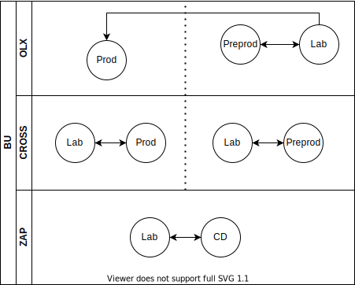

# Actions Runner

It's the hosted runner used do access stuff.


## How to use it
You just need to make you job run in the Runner with access to the resources that you need.

e.g.:

```yaml
runs-on: [self-hosted, company, prod]
runs-on: [self-hosted, company, develop]
runs-on: [self-hosted, company, qa]
```

## Using Volumes

To use volumes in docker containers running in the self-hosted runner, just use $PWD env when necessary.

e.g:
```yaml
  run: docker run -v $PWD:/vol alpine ls -l /vol
```

### Beta runners

In order to test new features such as new dependency and how they interact with the runner ecosystem, we have created the laboratory runners. Those can be used to your application to test the new environment and if the dependencies installed are enough to your application.

> Despite running in the same cluster as the normal runners, they are more susceptible to instabilities and deployments because of the new features added.

To run in the laboratory environment, your job need to run in one of those below:
```
- [self-hosted, company, prod-laboratory]
- [self-hosted, company, develop-laboratory]
- [self-hosted, company, qa-laboratory]
```

## How it works

We have a deployment running on each Kubernetes Cluster that requires external access.

## Clusters
* Production: CompanyProd
* Develop: CompanyDev
* QA: CompanyQa

## How to deploy
* To deploy in laboratory or tech radar clusters: Use `Build, push and deploy` workflow action located on TAB Actions
* To deploy in porduction and preprod clusters: Any tag created

## How to add new clusters
* Replace the placehoods in the yamls on deploy folder

```
export GITHUB_TOKEN="Github Personal Access Token"
#This token requires owner permission in the org, you can get it with dev-tools

export RUNNER_LABELS="self-hosted,ENV"
#e.g.: export RUNNER_LABELS="self-hosted,cross,prod"

export VERSION="last generated image"
#e.g.: export VERSION="v0.1.1"

export ENVIRONMENT=ENV
#e.g.: export ENVIRONMENT=prod

sed -i '' "s/\${container-registry-host}/$CONTAINER_REGISTRY_HOST/" k8s/$ENVIRONMENT/*.yml
sed -i '' "s/\${version}/$VERSION/" k8s/$ENVIRONMENT/*.yml
sed -i '' "s/<GITHUB_TOKEN>/$GITHUB_TOKEN/" k8s/$ENVIRONMENT/*.yml
sed -i '' "s/<RUNNER_LABELS>/$RUNNER_LABELS/" k8s/$ENVIRONMENT/*.yml
sed -i '' "s/<K8S_REPLICAS>/$K8S_REPLICAS/" k8s/$ENVIRONMENT/*.yml
```
* Apply the yamls to the cluster

```
kubectl apply -f deploy/
```

## Add tools and dependencies on runner image
To add a new tool or a dependency on the runner image, add a directory with the name of tool on directory `dependencies`
and inside this directory add a shell script called `install.sh` with the steps to install that tool, f.ex:
```
dependencies/
├── install-dependencies.sh
└── node
    └── install.sh
```
The example of a shell script than installs nodejs environment:
```bash
#!/bin/bash

curl -fsSL https://deb.nodesource.com/setup_16.x | bash -
apt-get install --no-install-recommends -y nodejs
npm install -g yarn
```
When we build a new version of the runner image the script `install-dependencies.sh` will install each dependency.

## Deployment strategy
This image shows how the deployment happens:



## Limitations (Future work)

* There is no autoscaler to the runners.
* Dind should run on a dedicated node pool
* We need to add a network policy to block access to dind from outside of the namespace

